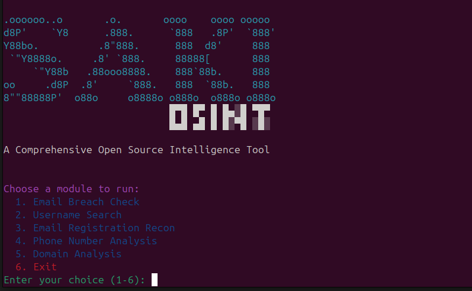

# SAKI OSINT  



---

**SAKI OSINT** is a comprehensive command-line tool designed to automate and simplify open-source intelligence (OSINT) tasks. It collects information about various targets (emails, usernames, phone numbers, domains) from publicly available sources and presents the results in a structured way.  

### Features
- **Email Breach Check (`email_breach`)** → Checks whether an email address appears in known data breaches.  
- **Username Search (`username`)** → Searches for the given username across social media and popular websites.  
- **Email Registration Recon (`email_recon`)** → Detects whether an email is registered on various websites.  
- **Phone Number Analysis (`phone`)** → Validates the number and retrieves operator & location details.  
- **Domain Analysis (`domain`)** → Provides WHOIS, DNS records, SSL/TLS versions, and email authentication records (SPF, DMARC, DKIM).  
- **Output to File** → Saves results into a file in addition to console output.  
- **Proxy Support** → Can use proxy settings from `config.ini`.  

### Installation
```bash
git clone https://github.com/YOUR_USERNAME/SAKI_OSINT.git
cd SAKI_OSINT
pip3 install -r requirements.txt
```

### Usage
```bash
python3 main.py
python3 main.py --output results.txt
```

### Configuration (`config.ini`)
```ini
[API_KEYS]
HIBP_API_KEY = YOUR_HIBP_API_KEY_HERE

[PROXY]
HTTP_PROXY = http://your_proxy_ip:port
HTTPS_PROXY = https://your_proxy_ip:port
```

### Contributing
Please use the GitHub repository for bug reports, feature requests, or contributions.  

**Contributors:**  
- Burçem Güloğlu  

### License
Licensed under the MIT License. See `LICENSE` for details.  
